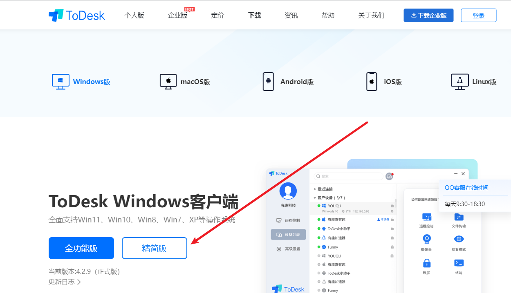
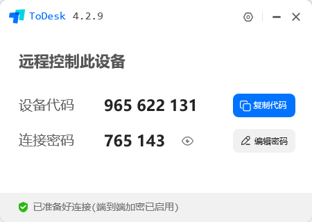

<h1>教程</h1>
<h2>第一步</h2>
<h3>先下载远程控制软件ToDesk<a href="https://dl.todesk.com/windows/ToDesk_Lite_x64.exe">点我下载</a>或者去<a href="javascript:window.open('https://www.todesk.com')">官网</a>下载</h3>

 
 
<h2>第二步</h2>
<h3>下载完打开软件截图发给我 (如下图)。注意：如果临时密码是隐藏的话点击后边小眼睛图标把密码显示出来</h3>  
  
<h2>完成</h2>
